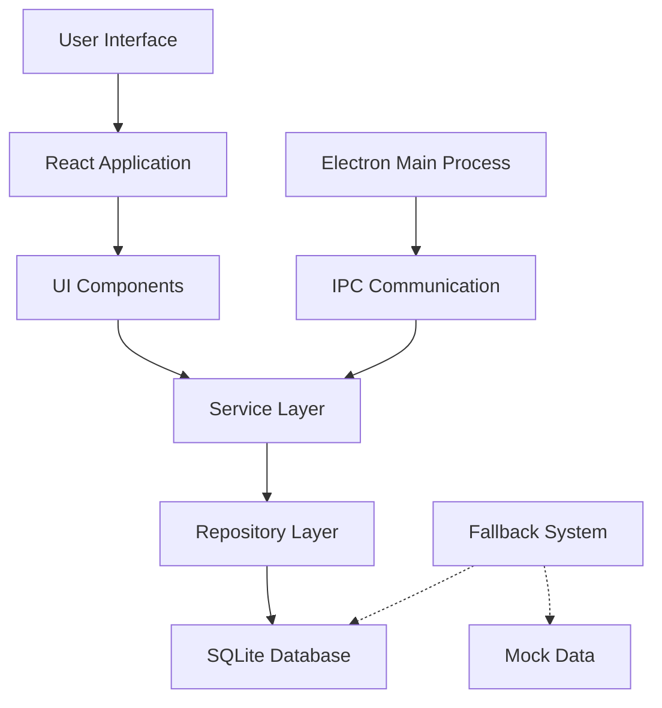

# Scholario System Patterns

## Architecture Overview

Scholario follows an Electron-based desktop application architecture with a React frontend and SQLite database backend:

## Key Design Patterns

### Repository Pattern
The application uses a repository pattern to abstract the database operations:
- Base repositories provide common CRUD operations
- Specific repositories (StudentRepository, etc.) extend the base with specialized methods
- Repositories return Effect.ts types for proper error handling

### Service Layer
Services encapsulate business logic and interact with repositories:
- StudentService handles operations related to students
- Each service defines its own Error types for precise error handling
- Services provide a clean API for the UI components

### Component Structure
UI components follow a hierarchical structure:
- Page components (StudentsPage, etc.) coordinate the overall view
- Table components (StudentTable) handle data display and interactions
- Form components (StudentForm) manage data entry
- Detail components (StudentDetailDrawer) show detailed information
- Common components are shared across different sections

### Fallback Mechanisms
The application implements several fallback mechanisms for robustness:
- Multi-path module loading for native dependencies
- In-memory SQLite as backup if file-based DB fails
- Mock data implementation when database is inaccessible
- Error boundaries to catch rendering exceptions
- Graceful degradation strategy throughout the application

### State Management
Application state is managed through:
- React Query for server state (data fetching, caching, updates)
- Local component state for UI state
- Form state is handled within form components
- Filters and selected items in list views

## Database Schema

Core tables include:
- students: Student information
- subjects: Course subject details
- groups: Course groups within subjects
- enrollments: Junction table linking students to groups
- subscriptions: Monthly subscription records
- payments: Payment records
- settings: Application settings
- backups: Backup metadata
- auditLogs: System audit logs
- users: User authentication data

## Authentication Flow

Simple access code-based authentication:
1. User enters access code on login screen
2. Code is validated against users table
3. If valid, user session is created in localStorage
4. Session is checked on app start and for protected operations

## Error Handling

The application implements a comprehensive error handling strategy:
- Services return Effect.ts types that can be either successful values or typed errors
- Error boundaries catch unhandled exceptions at the component level
- Toast notifications provide user feedback for operations
- Fallback UI components display when primary components fail
- IPC communication includes error logging and graceful failure handling
- Mock data system activates when the database is unavailable

## Cross-Cutting Concerns

### Logging
- Winston logger is used for application logging
- Logs are stored in the userData directory
- Different log levels based on operation importance
- IPC requests and responses are logged for troubleshooting
- Database operations log diagnostics for performance tracking

### Data Export
- Export functionality for students, payments, etc.
- Supports different formats (CSV, XLSX)
- Optional data anonymization (e.g., for phone numbers)

### Navigation
- Sidebar navigation with icon-based menu items
- Dashboard as central landing page with key metrics
- Consistent navigation patterns across the application 